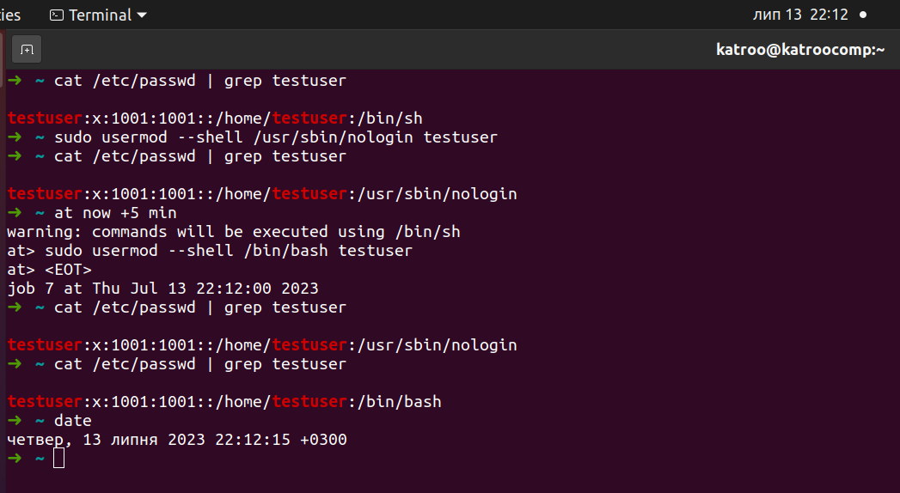

## The script creates user with name iptables_user_XXXX and takes email address from argument. If no need to send email, "no" argument is to be used

## Task with *: Temporarily disabling the user's login

