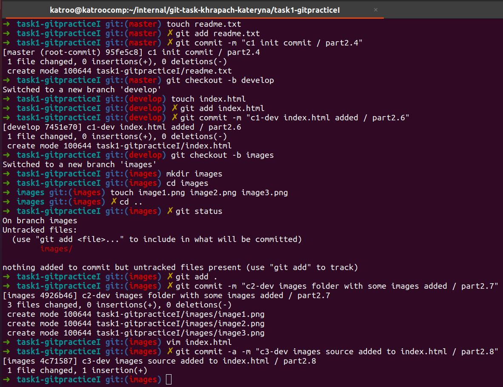
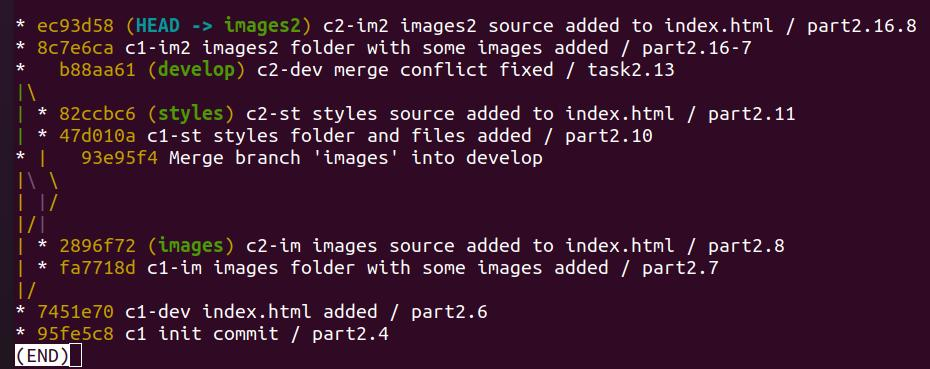

# m1-Git-Task-01

**PART1**

1.Install GIT on your workstation; 2.Setup git: change your global configs (add name and email, setup core text editor).

3.Create account on GitLab; 4.Generate ssh-key and integrate it with GitLab

5.Create new project on GitLab; 6.Clone project to your workstation

7.Create .gitignore file. Include .gitignore in its own list

7.Try to use different patterns in .gitignore file (see in lecture) to make invisible for git some local files that should not be commited. Check that files mentioned in .gitignore file shouldn’t be visible via executing git status command.

**PART2**

1.Open git console in root directory of your project and make next steps.

2.Do all your experiments in folder “task1 –git pracrice I”.

3.Create empty readme.txt file.

4.Make init commit.

5.Create develop branch and checkout on it.

6.Create index.html empty file. Commit.

7.Create branch with name “images”. Checkout on it. Add images folder with some images inside it. Commit.

8.Change your index.html. Add images source inside it. Commit.

9.Go back to develop branch.

10.Create branch with name “styles”. Checkout on it. Add styles folder with styles source inside it. Commit.

11.Change your index.html. Commit.

12.Go to develop branch.

13.Merge two new branches into develop using git merge command. Resolve conflict if it appears

15.Merge develop into master 

*Merging images and styles onto develop (default merge command)

*Merging images and styles onto develop --no-ff

16.Checkout to develop branch and repeat 7-15 items once more(use names “images2”, “styles2” for new branches). Now use git rebase command instead of git merge in step

Do rebase in next sequence:
• rebase “images2” onto “develop”
• rebase (fast-forward) “develop” onto “images2”
• rebase “styles2” onto ‘’develop’
• rebase (fast-forward) “develop” onto “styles2”

*Rebasing images2 / develop

develop before rebase:

images2 before rebase and after rebase develop 
(nothing's changed, because it already contains develop branch):

develop after rebase images2:

*Rebasing styles2 / develop

styles2 before rebase develop:

styles2 after rebase develop:

develop after rebase styles2:

17.Merge develop into master. 

As a result master/develop branches should contain all commits that were done in process

**ADDITIONAL TASK**

Write common sides and differences between merge and rebase commands.
 
*Both merge and rebase are used to integrate changes made in one branch to another. But while merge commit refers to previous commits, rebase copies commits from one branch to another* 

Write pros and cons for merge and rebase.

Merge
- PROS: *keeps commits history in chronological order;* 

    *you have options like ff or no-ff, can use squash merge*
- CONS: *history can become polluted by lots of merge commits, when many people are working on the same branch in parallel*

Rebase
- PROS: *looks linear, no additional commits, just those with real changes*
- CONS: *brings all changes in one branch, you see all commits that were done by all participants, that “clogs” the main branch;*
    
    *chronology of changes can be messed*

Describe situations for preferably usage of these commands.

*Most often it is better to use merge, when you work in team – because it saves chronological history and there’s several options of merge to choose which one is better for your project. You can use rebase on your own or within small teams*

