# m1-Git-Task-02

**PART1**

1.Checkout on ”develop”.

3.Create any file in new folder “task2 –git pracrice II”and commit it.

4.Create new branch “first”.

5.Create another new branch “second”.

6.Do one (or more) commits to “develop” (Add to repository some files, change them).

7.Checkout on the “first” branch and do several commits (about 5).
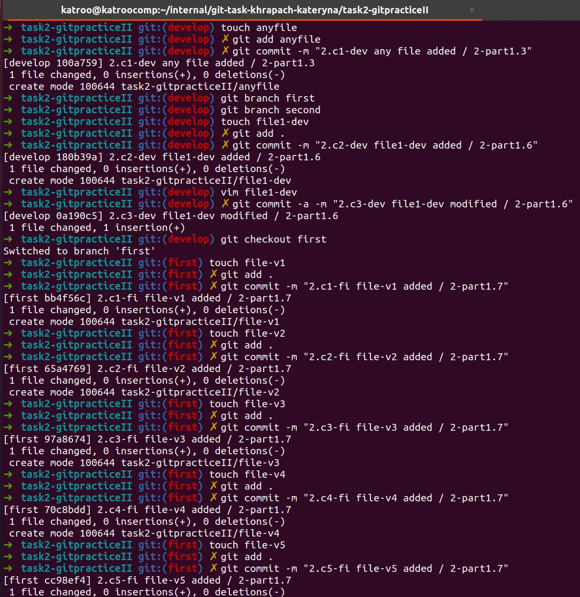

8.Checkout on the “second” branch and do several commits (about 3). Make sure that you have at least one commit, which contains changes in more than one file.
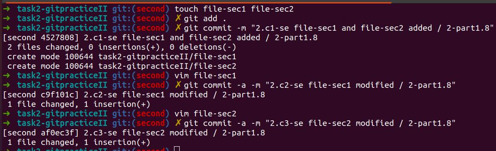

9.Do interactive rebasing. Your commits from the “second” branch should appear on the top of “develop” branch.
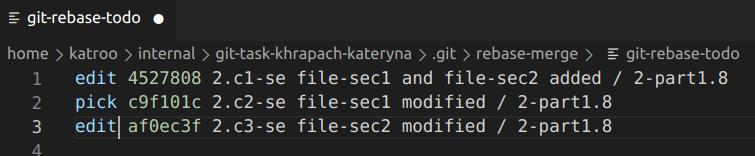

During interactive rebasing: 

• Divide one of your commits (so you should have two commits instead of one) 

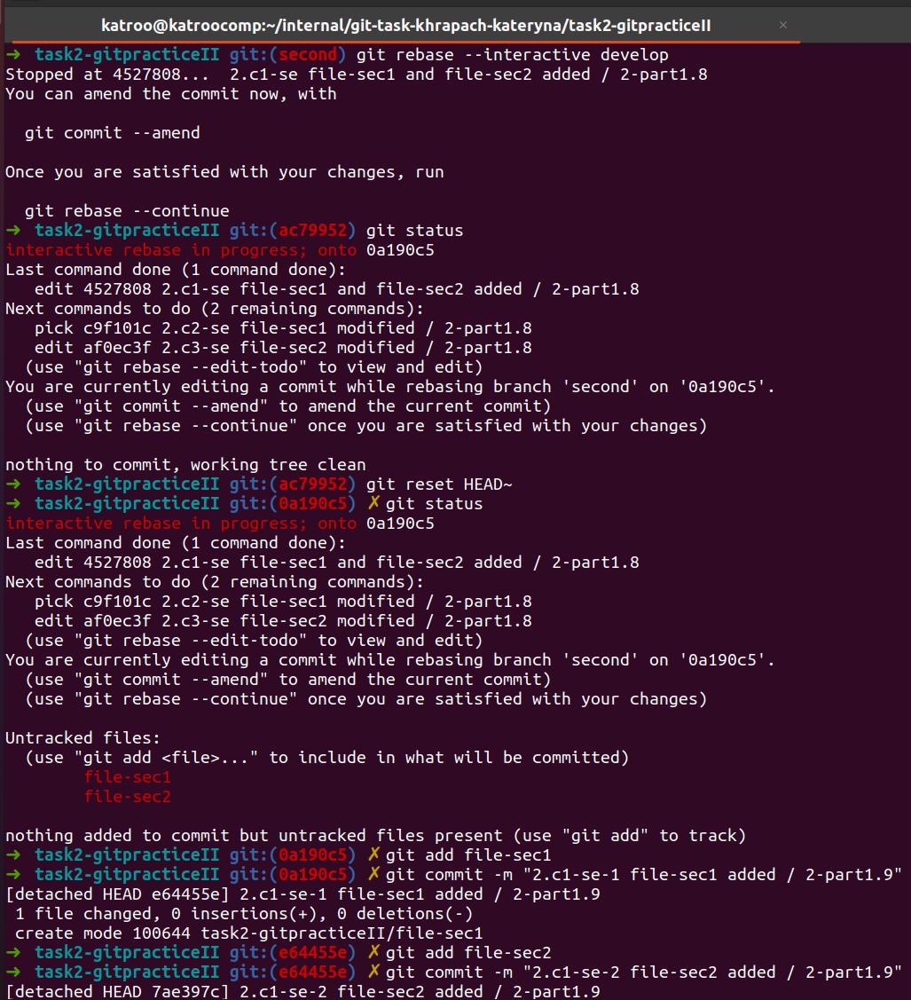

• Change content of other commit and change commit message for it

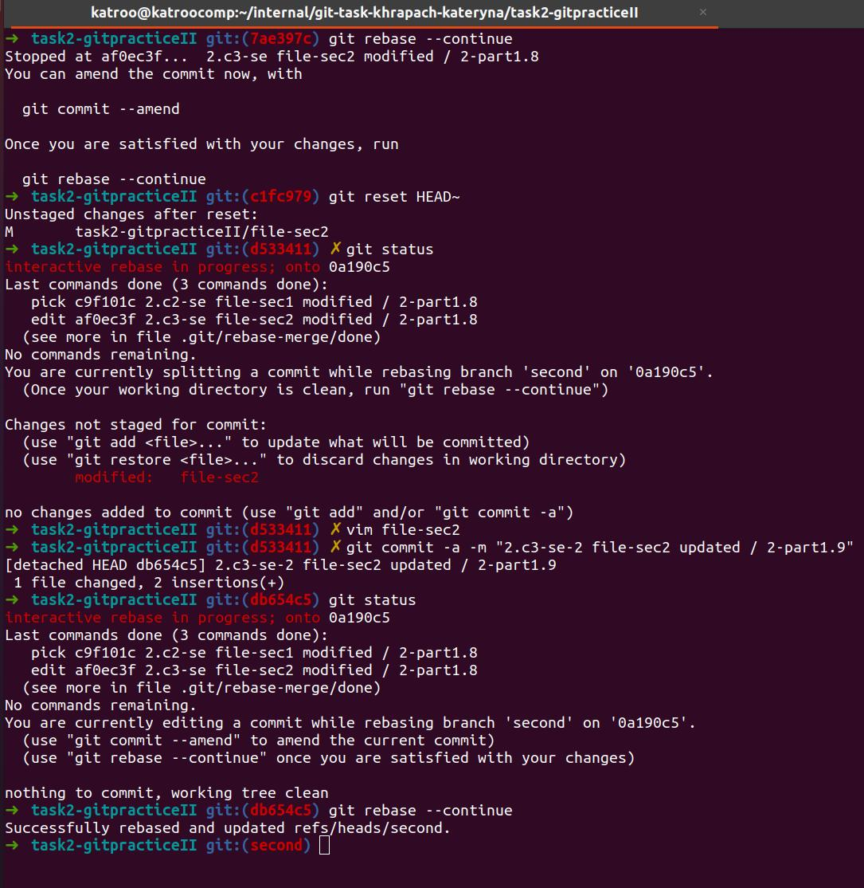

10.Merge “second” branch into develop(fast-forward).“Develop” and “second” branches should point to the same commit.

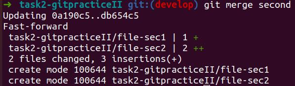

*Second branch before interactive rebase

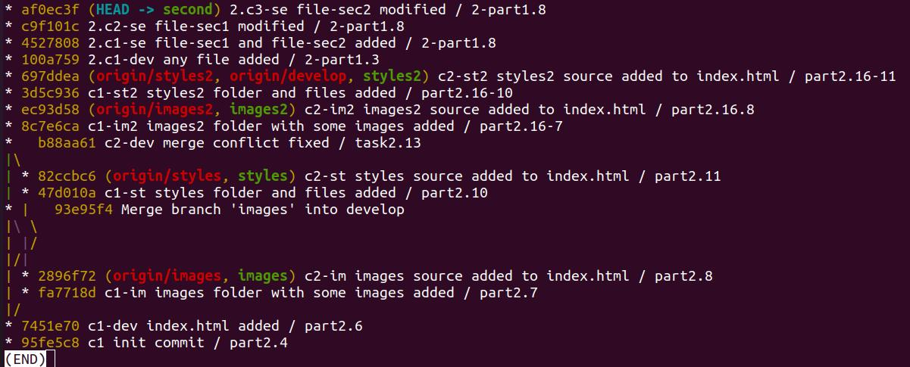

*Second branch after interactive rebase

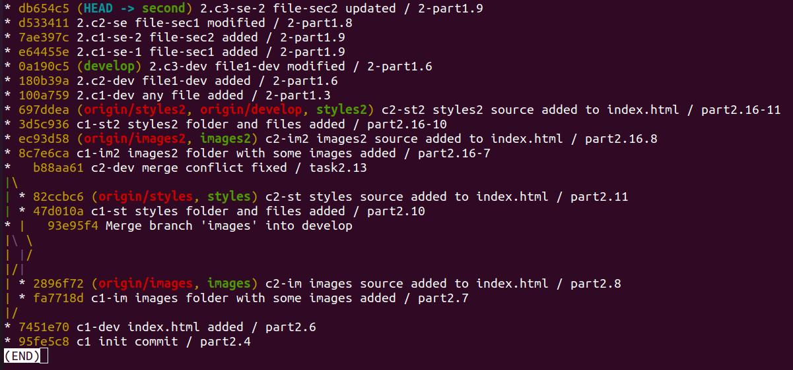

*Develop branch before merge second

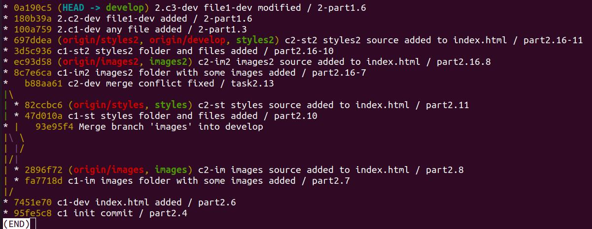

*Develop branch after merge second (ff)

11.Checkout to the ”first” branch;
12.Do interactive rebasing. Your commits from the “first” branch should appear on the top of “develop” branch. 

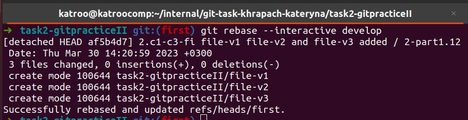

During interactive rebasing:

• Squash three commits into one; 
• Drop one commit.

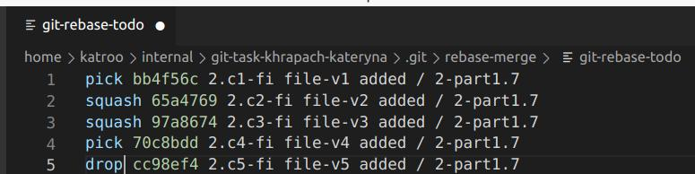

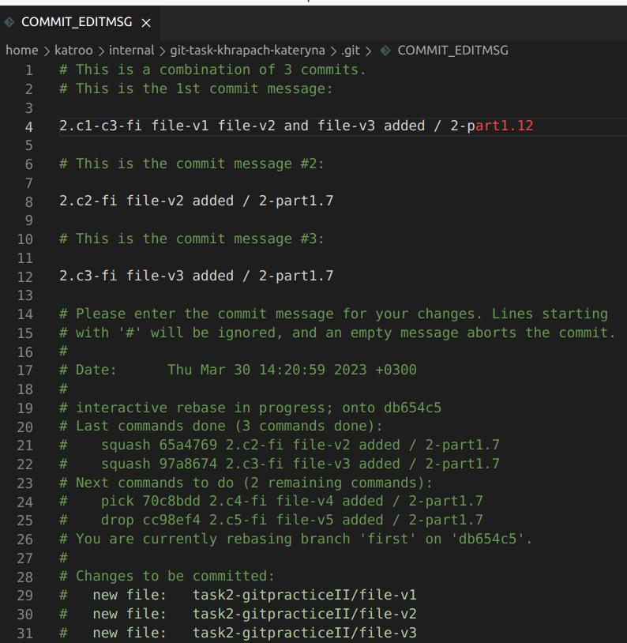

*First branch before rebase develop

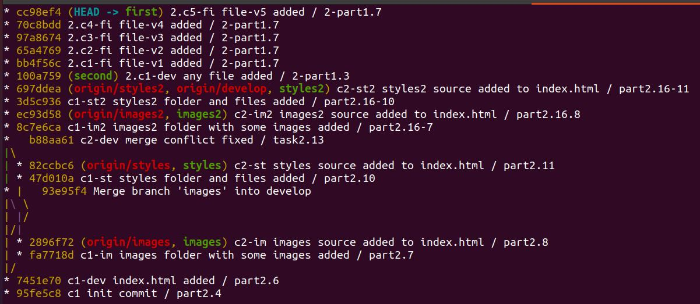

*First branch after rebase develop

*Develop branch before merge first

*Develop branch after merge first (ff)

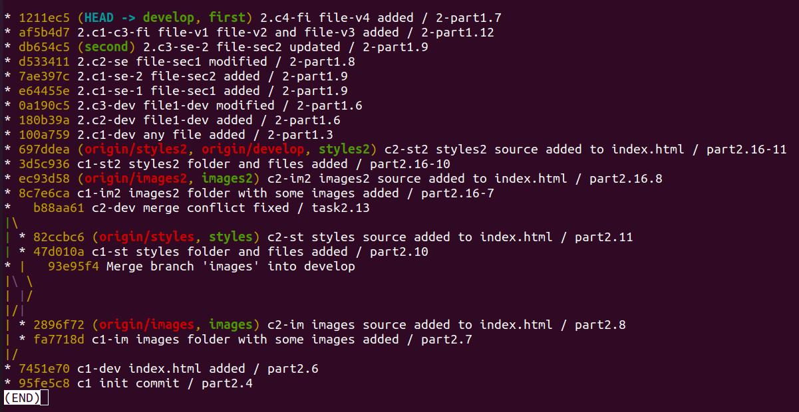

14.Merge the “develop” branch into “master” branch.

*Master branch before the last merge develop

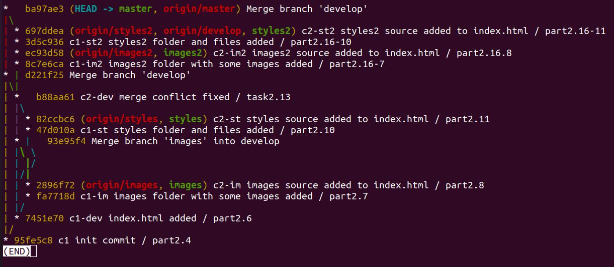

*Master branch after the last merge develop (no-ff)

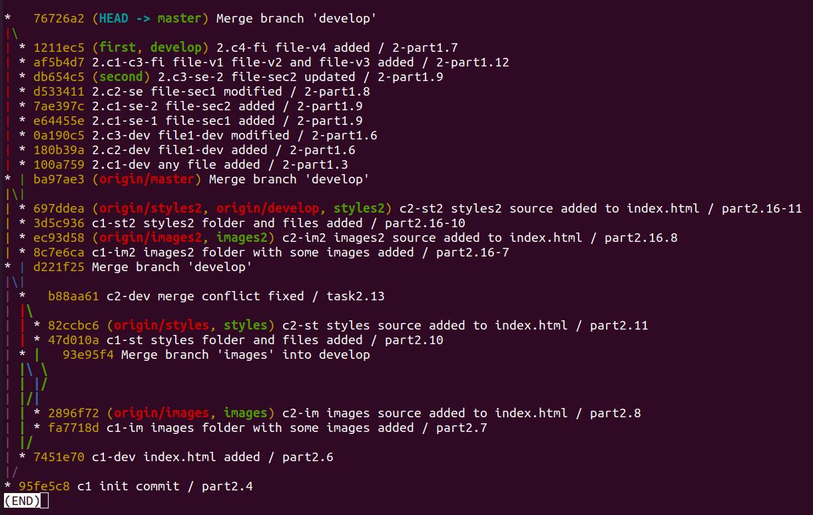

**ADDITIONAL TASK**

1.Create 4 commits into master branch with minor changes in file that is already exist.

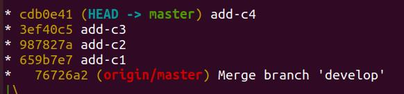

2.Execute command git reset--hard HEAD~4 

*After the command execution:*

3.Are you able to restore changes of third commit? Describe your steps how to do that.

*Found the commit HEAD@ in the reflog and did cherry-pick, resolved the conflict*

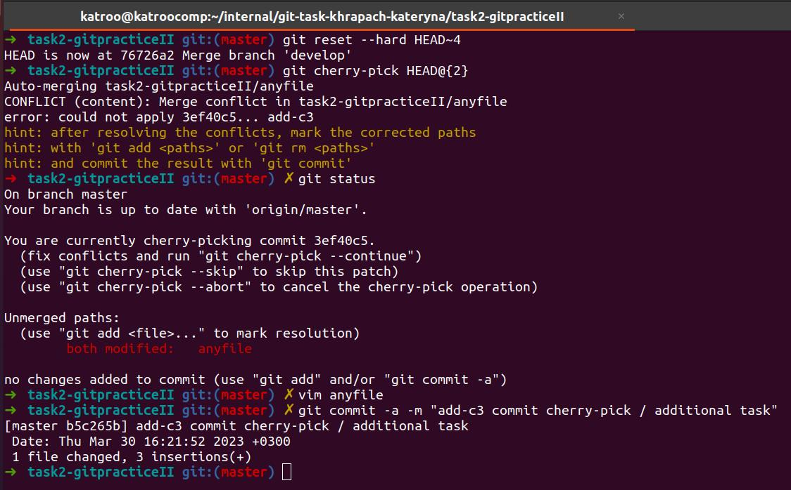

*Result:*

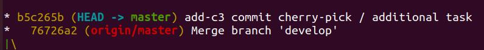

